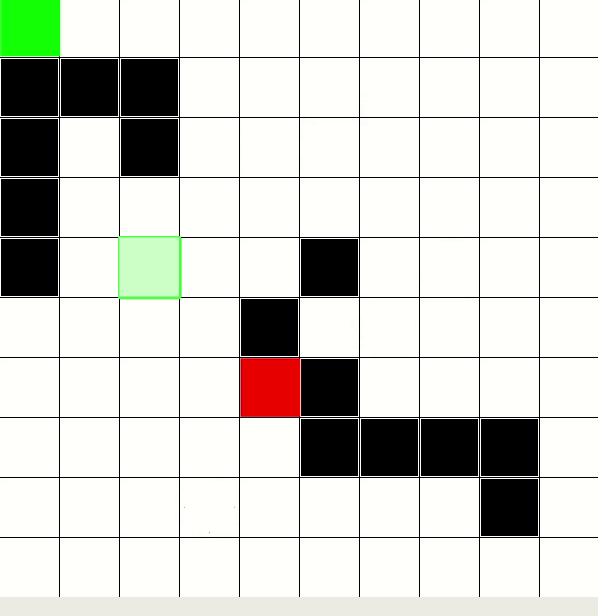
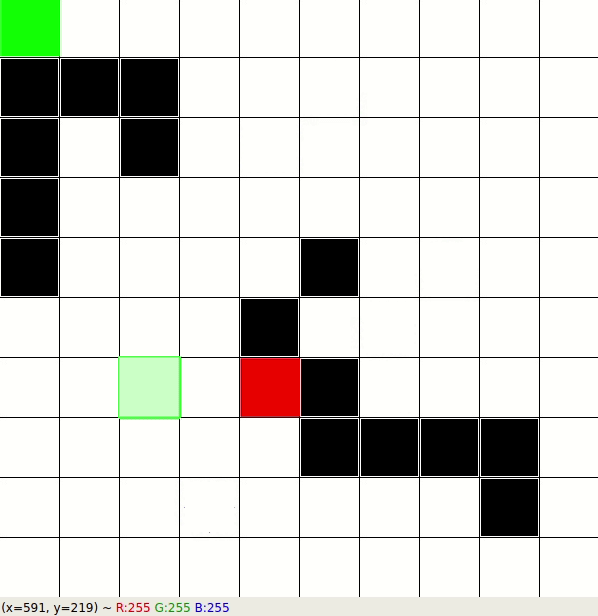

# Path Planning

## intro
Path-planning is an important primitive for autonomous mobile robots that lets robots find the shortest --or otherwise optimal-- path between two points. Optimal paths could be paths that minimize the amount of turning, the amount of braking or whatever a specific application requires. Algorithms to find the shortest path are important not only in robotics but also in network routing, video games, and understanding protein folding.
## Python Implementation
A* and Dijkstra were implemented in python. To run the code in Python you need OpenCV and NumPy. The easiest way to install is by using Anaconda or Conda. The code has been executed on the Linux machine. you can install OpenCV with this:
```bash
conda install -c conda-forge opencv=4.1.0
``` 
## Code Explanation
There is a map.png file in the test_images folder that represents our map. First, using OpenCV, the image is represented using a matrix, and then the path planning algorithm will run on the matrix.
### A* algorithm simulation
This gif shows the execution of the program. The green rectangle is the starting point, and the red one is our end goal.


### Dijkstra algorithm simulation
To run the Dijkstra algorithm, you can use the A* algorithm, but the only thing that you need to change is to change f(n) function to f(n)=g(n).

